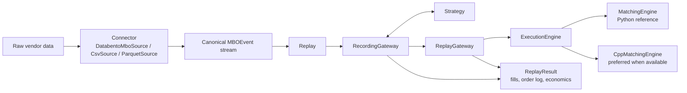
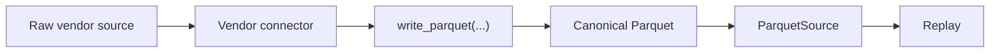
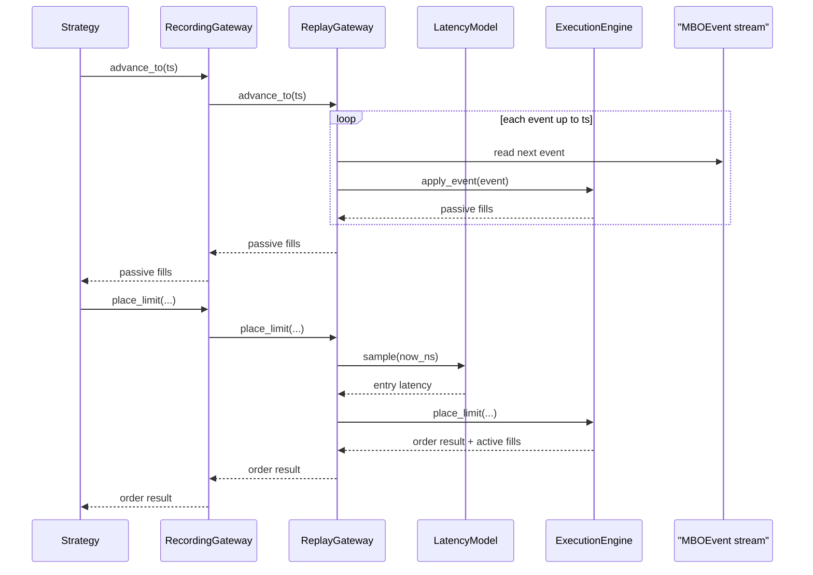
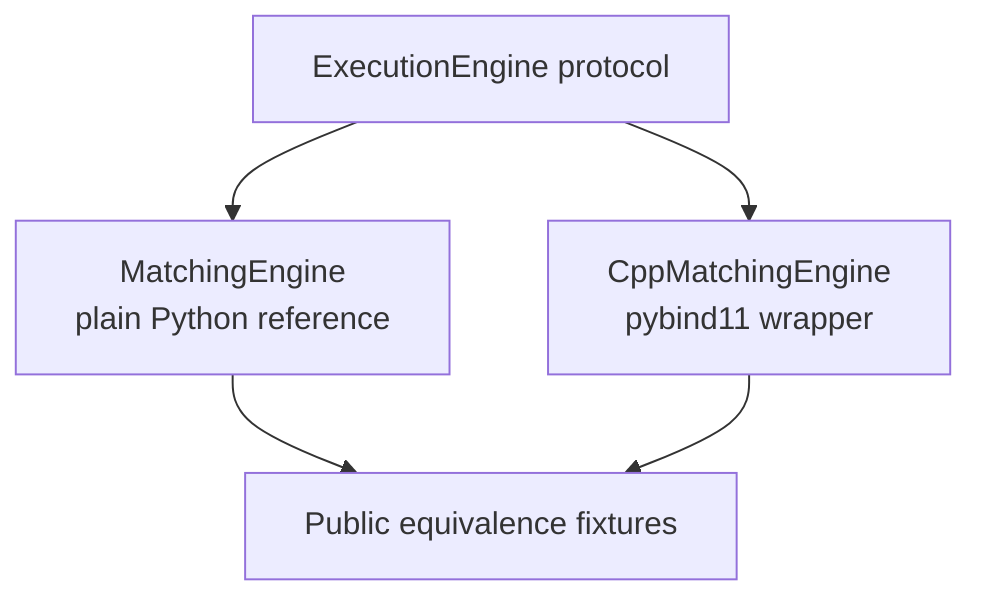
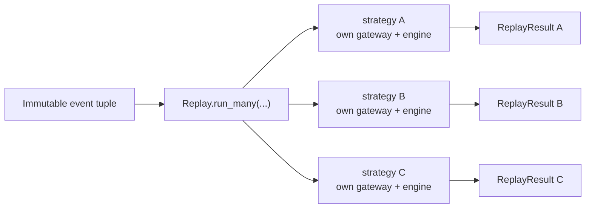

# Architecture

`ordersim` is deliberately small. Strategies do not talk to connectors or
matching engines directly; they talk to the public gateway. Replay coordinates
the rest.

## Component View

The main boundaries are:

- connectors normalize external data into `MBOEvent`;
- strategies depend on `OrderGateway`, not on storage or engine internals;
- replay normalizes inputs once, chooses an execution engine, and gathers
  results;
- the Python engine defines behavior; the C++ engine must match it.

## Recommended Data Flow

Direct connector replay is supported, but repeated research should normally
materialize canonical Parquet once and replay from it thereafter. See
`docs/data-guide.md`.

## One Replay Run

The order log is recorded at the gateway boundary, so it captures strategy
intent as well as resulting fills.

## Execution Engines

`Replay(...)` prefers `CppMatchingEngine` when the extension is importable,
because it preserves the same public behavior while avoiding the Python hot
loop. `MatchingEngine` remains the reference implementation because it is the
easiest place to inspect queue behavior and define equivalence.

Inside that reference engine, public market-data mutations are kept separate
from strategy-order matching helpers so the book lifecycle can be read in the
same order the simulator applies it.

Compiled-engine changes are accepted only when they match the public Python
fixtures.

## Multi-Strategy Replay

`run_many(...)` does not let strategies share mutable execution state. `Replay`
first builds one immutable canonical event tuple; each strategy then receives
its own gateway, engine, order log, fills, and portfolio summary while reading
that same tuple. The intended property is solo-equivalence: running a strategy
inside `run_many(...)` should match running it alone on the same input.

## Where To Extend

| Goal | Extension point |
|---|---|
| Support a new vendor format | add a connector under `ordersim/connectors/` |
| Add a latency assumption | implement `LatencyModel` |
| Add an execution implementation | implement `ExecutionEngine` and prove equivalence |
| Change strategy logic | use only the `OrderGateway` surface |

If a proposed change crosses several of those rows at once, pause and check
whether it is really one feature or several.

## Related Docs

- Data workflow: `docs/data-guide.md`
- Connector details: `docs/connectors.md`
- Engine behavior: `docs/execution-engines.md`
- Public schema: `docs/schema.md`
- Assumptions: `docs/assumptions.md`
